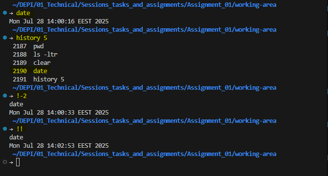

# Script with some commands to manage files, directories and permissions in Linux:

```bash
#!/bin/bash

ls -ltr
 
touch file1.txt && echo "file1.txt Created"
ls -ltr
 
chmod 644 file1.txt && echo "Permissions Assigned to file1.txt"
ls -ltr
 
rm file1.txt && echo "file1.txt Removed"
ls -ltr
 
mkdir dir1 && echo "dir1 Created"
ls -ltr
 
chmod 754 dir1 && echo "Permissions Assigned to dir1"
ls -ltr
 
rm -r dir1 && echo "dir1 Removed"
ls -ltr
```
> 


# Add Users: 
```bash
# an interactive way to add users
adduser test-user-1
```
> 

-----

# Delete Users:
```bash
# delete a user without removing its home directory
sudo userdel test-user-2
# delete a user and remove its home directory
sudo userdel test-user-1 -r
```
> 

# Switch between two users:
```bash
# switch to test-user-1
su - test-user-1
# the uses of `-` is to switch directly to the user home directory.
```
> 

# Print the Working Directory:
```bash
# print the current working directory
pwd
```
> 

# Creat and remove a Directory:
```bash
# create a directory
mkdir test-dir-1
# remove a directory
rm -rf test-dir-1
# the `-r` flag is used to remove directories and their contents recursively.
# the `-f` flag is used to force the removal without prompting for confirmation.
``` 
> 

# File management:
```bash
# create a file
touch test-file-1
# create an write in a file at once
vim test-file-1
```
> 

```bash
# preview the content of the file
cat test-file-1
```
> 

```bash
# search on a file 
cat test-file-1 | grep karim
            # or 
grep -in karim test-file-1
    # `-i` is used for insensitive search
    # `-n` is used to print the line number
```
> 

```bash
# search for a file by its name
find -name test-file-1
```
> 

```bash
# change the permissions by two ways
chmod u=rwx,go=r test-file-1
    # assign a read, write and execute permissions to the user
    # assign a read permission to the group and others 
chmod 644 test-file-1
    # assign a read and write permissions to the user
    # assign a read permission to the group and others
```
> 

```bash
# rename a file
mv test-file-3 file-3
```
> 

```bash
# move a file
mv file-3 test-dir-1/
```
> 

```bash
# copy a file
cp test-file-1 test-dir-1/
``` 
> 

```bash
# delete a directories
rm -r test-dir-1/
```
> 

# date and history related commands
```bash
date
history 5
!-2
!!
````
> 

# Making alias for commands
```bash
alias ll='ls -l'
alias date='date +%F_%r'
alias saymyname='whoami'
```
> 
> 
>> ## If you know, you know. 😄