# Docker Basics Assignment

This document outlines the steps to run the Spring Petclinic application locally and then demonstrates fundamental Docker operations, including containerizing the application.

## Part 1: Running Spring Petclinic Locally

### 1\. Install Java

First, we need to install the Java Development Kit (JDK). We will use OpenJDK version 17.

```bash
# Update package list
sudo apt update

# Install OpenJDK 17
sudo apt install openjdk-17-jdk

# Verify the installation
java --version
```
> 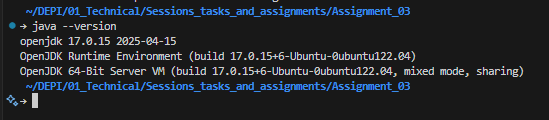

### 2\. Build and Run the Java App

Navigate to the project directory and use the Maven wrapper (`mvnw`) to build and run the application in one step.

```bash
# Change into the project directory
cd spring-petclinic

# Use the Maven wrapper to run the Spring Boot application
./mvnw spring-boot:run
```
> 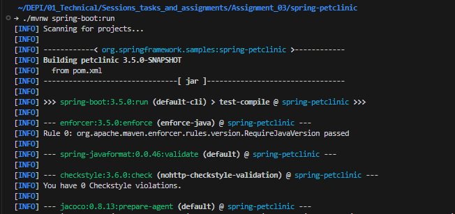
> 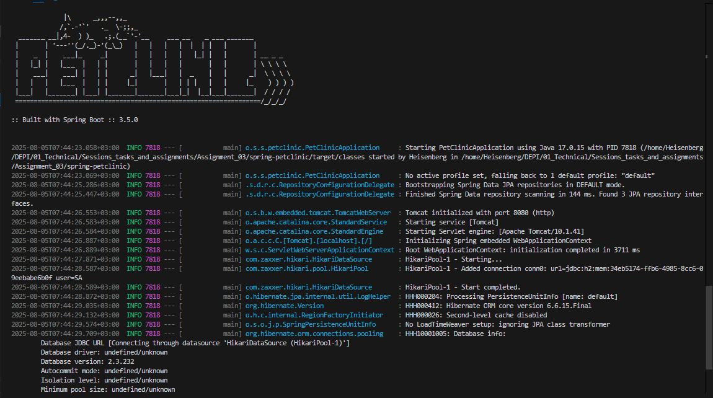

### 3\. Accessing the Application

Once running, the application can be accessed in your browser.

  * **Inside WSL (using VSCode's internal browser):**

      * `http://localhost:8080`
      > 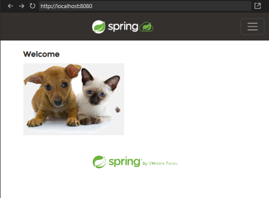

  * **From the host machine (e.g., Windows/macOS browser):**

      * First, find the IP address of your WSL instance.
        ```bash
        hostname -I
        ```
      * Use the displayed IP address (e.g., `172.27.165.254`) to access the app.
      * `http://172.27.165.254:8080`
      > 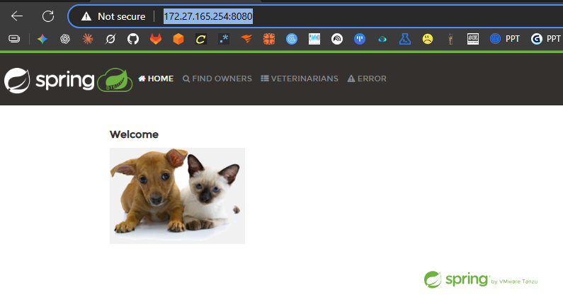
-----

## Part 2: Core Docker Operations

### 1\. Login to Docker Hub

Log in to your Docker Hub account to pull private images or push your own.

```bash
docker login
```

### 2\. Pulling Common Docker Images

Pull some common base images from Docker Hub to have them available locally.

```bash
docker pull nginx
docker pull php
docker pull node
docker pull alpine
docker pull ubuntu
```
> 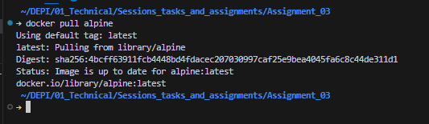
### 3\. Saving and Loading Images

You can save a Docker image to a `.tar` archive for backup or transfer, and then load it on another machine.

```bash
# Save an image to a .tar file
docker save <image-name>:<tag> -o <filename>.tar
# Example: docker save nginx:latest -o nginx.tar

# Load an image from a .tar file
docker load -i <filename>.tar
# Example: docker load -i nginx.tar
```
> 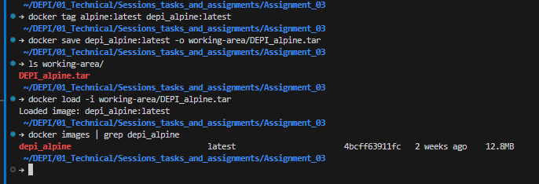

### 4\. Running Containers

You can run a container and map its ports to the host machine in different ways.

```bash
# Run a container and map its port to a RANDOM host port
# The '-d' flag runs it in detached mode, '--rm' removes it on stop
docker run -itd --rm --name nginx-random-port -P nginx
```
> 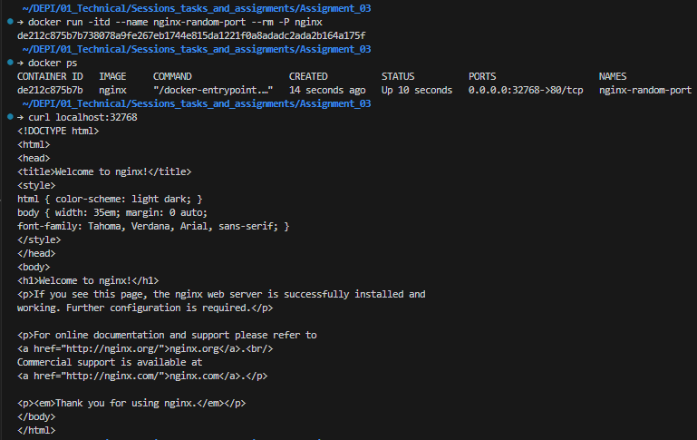
```bash
# Run a container and map its port 80 to a SPECIFIC host port (5050)
docker run -itd --rm --name nginx-specific-port -p 5050:80 nginx
```
> 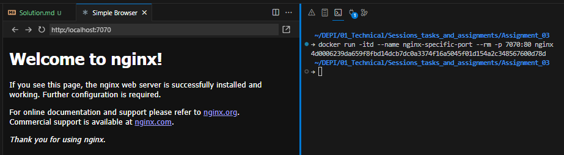


### 5\. Customizing a Container and Creating a New Image

You can modify a running container and then commit those changes to create a new, custom image.

```bash
# Copy a custom index file into the container
docker cp index.html nginx-specific-port:/usr/share/nginx/html/

# Copy a custom image asset into the container
docker cp 1.jpg nginx-specific-port:/usr/share/nginx/html/images/

# Copy a custom Nginx configuration file
docker cp docker.conf nginx-specific-port:/etc/nginx/conf.d/

# Commit the changes to a new image
docker commit -m "My custom nginx image" nginx-specific-port my-custom-nginx:1.0

# Accessing the custom Nginx container from the host machine
http://docker-site.local:7777
```
> 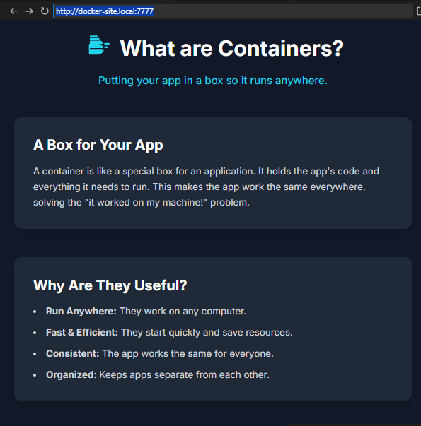


### 6\. Running Spring Petclinic in a Container

The easiest way to run the Petclinic application in Docker is by using a pre-built image.

```bash
# Pull the pre-built Spring Petclinic image
docker pull contrastsecuritydemo/spring-petclinic:1.5.1

# Run the container, mapping port 8080 inside to port 8888 on the host
docker run -d --name petclinic -p 8888:8080 contrastsecuritydemo/spring-petclinic:1.5.1

```

You can now access the containerized application at `http://localhost:8888`.
> 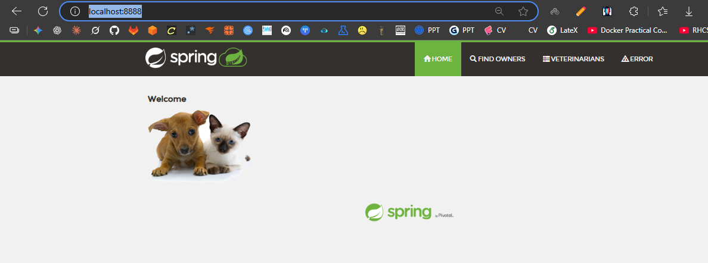
-----

## Appendix: Understanding the Spring Petclinic Build Process

1.  **JDK (Java Development Kit)**: The `openjdk-17-jdk` package is installed. It contains two main components:

      * `javac`: The Java compiler, which transforms human-readable `.java` source files into `.class` bytecode files.
      * `JRE` (Java Runtime Environment): The virtual machine that executes the compiled `.class` files.

2.  **Maven (`mvnw`)**: The Maven wrapper (`./mvnw`) is a build automation tool that reads the `pom.xml` file to:

      * Download all necessary project dependencies (libraries).
      * Compile the source code.
      * Package all `.class` files and resources into a single executable `.jar` file.

3.  **Running the Application**: There are two common ways to run the application using Maven.

    1.  **Build then Run (Two Steps)**
        ```bash
        # 1. Package the application into a .jar file
        ./mvnw package

        # 2. Run the .jar file with Java
        java -jar target/spring-petclinic-*.jar
        ```
    2.  **Build and Run (One Step)**
        ```bash
        # This command compiles, packages, and runs the app simultaneously
        ./mvnw spring-boot:run
        ```