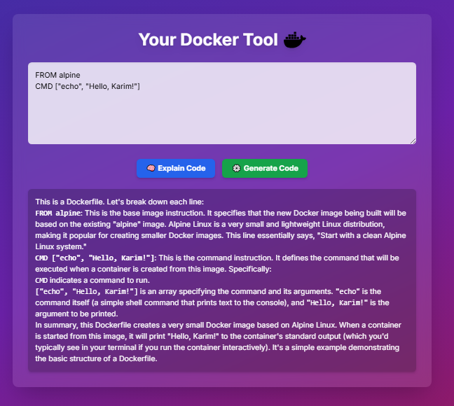
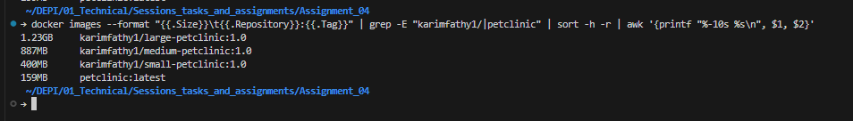

# Assignment_04

## Outlines:

1. Create a Dockerfile that has all pre-explained commands like:
2. Create a Dockerfile that has multilayers to run spring-petclinic app
3. Try to minimize the size of the Dockerfile using preinstalled packages from the base image and use RUN with `&&`.
4. Try to only copy the jar file to the image.
5. Compare the size of spring-petclinic's images

# 1. Create a Dockerfile that has all pre-explained commands like:

> ### FROM, WORKDIR, RUN, COPY, ADD, ENV, ARG, ENTRYPOINT and CMD

## Let's Have a Look:

```dockerfile
FROM nginx

WORKDIR /usr/share/nginx/sites/docker/

COPY index.html .

ADD site.conf.tar /etc/nginx/conf.d/

ENV MADE_BY="Heisenberg"

ARG UPDATE_PACKAGES="apt-get update"

ARG INSTALL_BTOP="apt-get install -y htop"

RUN ${UPDATE_PACKAGES} && ${INSTALL_BTOP}

ENTRYPOINT ["nginx"]

CMD ["-g", "daemon off;"]
```

## Let's Break it Down:

```dockerfile
FROM nginx 
```

- This specifies the base image to use, which is the official Nginx image.

```dockerfile
WORKDIR /usr/share/nginx/sites/docker/
```

- This sets the working directory inside the container to `/usr/share/nginx/sites/docker/`.

```dockerfile
COPY index.html .
```

- This copies the `index.html` file from the host machine to the current working directory inside the container.

```dockerfile
ADD site.conf.tar /etc/nginx/conf.d/
```

- This adds the `site.conf.tar` file to the Nginx configuration directory. The `ADD` command can also extract tar files, but in this case, it is assumed that `site.conf.tar` contains Nginx configuration files.

```dockerfile
ENV MADE_BY="Heisenberg"
```

- This sets an environment variable `MADE_BY` with the value "Heisenberg". This can be used to pass metadata or configuration to the container.

```dockerfile
ARG UPDATE_PACKAGES="apt-get update"
```

- This defines a build-time variable `UPDATE_PACKAGES` that can be used in the `RUN` command to update the package list.

```dockerfile
ARG INSTALL_BTOP="apt-get install -y htop"
```

- This defines another build-time variable `INSTALL_BTOP` that can be used to install the `htop` package.

```dockerfile
RUN ${UPDATE_PACKAGES} && ${INSTALL_BTOP}
```

- This runs the commands defined in the `UPDATE_PACKAGES` and `INSTALL_BTOP` variables. It updates the package list and installs `htop` in the container.

```dockerfile
ENTRYPOINT ["nginx"]
```

- This sets the entrypoint for the container to run the Nginx server. The container will start with this command when it is run.

```dockerfile
CMD ["-g", "daemon off;"]
```

- This provides default arguments to the entrypoint command.
- In this case, it tells Nginx to run in the foreground (`daemon off`), which is necessary for the container to keep running.

## The `index.html` as a Docker AI Tool

`index.html` is the primary file for a web page that serves as a user interface for a Docker-related AI tool. Its purpose is to provide an interactive and visually appealing front-end that allows users to input a prompt or code, trigger an API call to a Gemini AI model to explain or generate code, and display the results. The updated design uses Tailwind CSS for a modern, responsive layout with a clean aesthetic, featuring a header, input area, buttons, and a result display section, all styled to enhance user experience.

### Key Features:

- **Responsive Design**: Adapts seamlessly to desktop and mobile devices.
- **Interactive Input**: A text area for users to enter code or prompts, styled with a modern look.
- **Styled Buttons**: Buttons to trigger "Explain Code" and "Generate Code" actions with hover effects.
- **Result Display**: A dedicated section to show the AI's response with clear formatting.
- **Professional Look**: Uses Tailwind CSS for a polished, dark-themed UI with subtle animations.

## Build the Docker Image:

```bash
docker build -t karimfathy1/docker-ai:1.1.3 .
```

- To build the Docker image from the Dockerfile

```bash
docker run --name docker-ai-container -dp 1010:50 karimfathy1/docker-ai:1.1.3 
```

- To run the Docker container to access the webpage

```bash
docker exec docker-ai-container bash
```

- To run the docker container to access the container

### To access it, just type: `http://localhost:1010`

> 

---

# 2. Create a `LARGE SIZE` Docker image that has multilayers to run spring-petclinic app:

## Let's Have a Look:

```dockerfile
FROM ubuntu

WORKDIR /petclinic-app

COPY . .

RUN apt-get update
RUN apt-get install -y openjdk-17-jdk
RUN ./mvnw package -DskipTests -Dcheckstyle.skip=true

EXPOSE 8080

# ./mvnw help:evaluate -Dexpression=project.build.finalName -q -DforceStdout
# to know the full jar file name 

ENTRYPOINT ["java", "-jar"]
CMD ["target/spring-petclinic-3.5.0-SNAPSHOT.jar"]
```

## Let's Break it Down:

```dockerfile
FROM ubuntu
```

- This specifies the base image, which is the official **Ubuntu** image. It provides a clean, minimal Linux environment to build upon.

```dockerfile
WORKDIR /petclinic-app
```

- This command sets the working directory inside the container to `/petclinic-app`. All subsequent commands, like `COPY`, will be executed relative to this path.

```dockerfile
COPY . .
```

- This copies all files from the current directory on the host machine (where the Dockerfile is located) into the `/petclinic-app` directory inside the container. This includes the source code for the Spring PetClinic application.

```dockerfile
RUN apt-get update
RUN apt-get install -y openjdk-17-jdk
```

- These two separate `RUN` commands update the package list and then install the **OpenJDK 17 JDK**. This is a multi-layer approach where each `RUN` command creates a new layer in the final image.

```dockerfile
RUN ./mvnw package -DskipTests -Dcheckstyle.skip=true
```

- This command executes the **Maven wrapper** to package the application. The flags `-DskipTests` and `-Dcheckstyle.skip=true` are used to skip tests and checkstyle checks, which helps speed up the build process. This command generates the final `.jar` file.

```dockerfile
EXPOSE 8080
```

- This instruction informs Docker that the container listens on **port 8080** at runtime. It's a form of documentation and doesn't actually publish the port; you still need to use the `-p` flag with `docker run` to make it accessible from the host.

```dockerfile
ENTRYPOINT ["java", "-jar"]
```

- This sets the main command that will be executed when the container starts. In this case, it's `java -jar`. The `CMD` instruction will provide the argument to this command.

```dockerfile
CMD ["target/spring-petclinic-3.5.0-SNAPSHOT.jar"]
```

- This provides the default argument for the `ENTRYPOINT`. When combined, the container will run `java -jar target/spring-petclinic-3.5.0-SNAPSHOT.jar`. This is the command that starts the Spring PetClinic application.

## Build the Docker image:

```bash
docker build -t karimfathy1/large-petclinic:1.0 .
```

- To build the Docker image from this Dockerfile.

```bash
docker run --name large-petclinic-container -dp 4040:8080 karimfathy1/large-petclinic:1.0
```

- To run the Docker container and access the spring-petclinic app at `http://localhost:4040`.

---

# 3. Create a `MEDIUM SIZE` Docker image that has Dockerfile with much fewer layers:

## Let's Have a Look:

```dockerfile
FROM openjdk:17-oraclelinux9

WORKDIR /petclinic-app

COPY . .

RUN ./mvnw package -DskipTests -Dcheckstyle.skip=true \
    && dnf clean all

EXPOSE 8080

CMD ["/bin/sh", "-c", "java -jar target/spring-petclinic*.jar"]
```

## Let's Break it Down:

```dockerfile
FROM openjdk:17-oraclelinux9
```

- This specifies the base image as **OpenJDK 17 on Oracle Linux 9**. Unlike the previous version that started from a plain Ubuntu image, this uses a pre-configured image with Java 17 installed, which matches the requirements of spring-petclinic 3.5.0 and reduces the need for additional installation steps, helping minimize the overall image size.

```dockerfile
WORKDIR /petclinic-app
```

- This sets the working directory inside the container to `/petclinic-app`. All following commands will be relative to this path, similar to the previous Dockerfile.

```dockerfile
COPY . .
```

- This copies all files from the current directory on the host (including the source code) into the working directory in the container. This is the same as in the multi-layer version but is part of the effort to keep the build straightforward.

```dockerfile
RUN ./mvnw package -DskipTests -Dcheckstyle.skip=true \
    && dnf clean all
```

- This is a single `RUN` command that combines multiple actions to create fewer layers in the image. It first packages the application using the Maven wrapper, then cleans up the DNF cache to reduce the image size by removing unnecessary files. The use of `&&` chains the commands, ensuring they run sequentially in one layer.
- The flags `-DskipTests` and `-Dcheckstyle.skip=true` are used to optimize the build process:
  - `-DskipTests`: Skips running unit tests during the Maven build, which reduces build time and avoids potential test failures that aren't relevant for creating the JAR file.
  - `-Dcheckstyle.skip=true`: Disables Checkstyle, a static code analysis tool that enforces coding standards. Skipping it prevents build failures due to style violations and speeds up the packaging process.

```dockerfile
EXPOSE 8080
```

- This documents that the container will listen on **port 8080** at runtime. It doesn't publish the port but serves as metadata for users running the container.

```dockerfile
CMD ["/bin/sh", "-c", "java -jar target/spring-petclinic*.jar"]
```

- This sets the default command to run when the container starts. It uses a shell to execute `java -jar` on the packaged JAR file (using a wildcard `*` to match the versioned filename). This approach avoids hardcoding the exact JAR name and combines the entrypoint and command into a single `CMD` for simplicity.

### Use of `.dockerignore`:

The following `.dockerignore` file was used to exclude all files except the `target/` directory and the specific JAR file needed for the application:

```
*
!target/
!target/spring-petclinic-3.5.0-SNAPSHOT.jar
```

- **Purpose of** `.dockerignore`:
  - The `*` excludes all files and directories in the build context by default.
  - The `!target/` includes the `target/` directory, which contains the built JAR file.
  - The `!target/spring-petclinic-3.5.0-SNAPSHOT.jar` ensures only the specific JAR file is included, preventing other build artifacts or temporary files from being copied into the image.
  - This minimizes the build context, reducing the image size and speeding up the build process by excluding unnecessary files like source code, documentation, or test files.

## Build the Docker image:

```bash
docker build -t karimfathy1/medium-petclinic:1.0 .
```

- To build the Docker image from this Dockerfile.

```bash
docker run --name medium-petclinic-container -dp 3030:8080 karimfathy1/medium-petclinic:1.0
```

- To run the Docker container and access the spring-petclinic app at `http://localhost:3030`.

---

# 4. Create a `SMALL SIZE` Docker image that has the least possible layers

## Let's Have a Look:

```dockerfile
FROM openjdk:17-alpine

WORKDIR /app

COPY target/spring-petclinic-3.5.0-SNAPSHOT.jar .

CMD ["java", "-jar", "spring-petclinic-3.5.0-SNAPSHOT.jar"]
```

## Let's Break it Down:

```dockerfile
FROM openjdk:17-alpine
```

- This specifies the base image as **OpenJDK 17 on Alpine Linux**. Alpine is a lightweight Linux distribution, significantly smaller than Ubuntu or Oracle Linux, which helps create a minimal image size. The `openjdk:17-alpine` image comes with Java 17 pre-installed, eliminating the need for additional installation steps.

```dockerfile
WORKDIR /app
```

- This sets the working directory inside the container to `/app`. This is a simpler and shorter path compared to previous examples, reducing complexity while maintaining clarity.

```dockerfile
COPY target/spring-petclinic-3.5.0-SNAPSHOT.jar .
```

- This copies only the pre-built JAR file from the host machine into the `/app` directory in the container, aligning with the goal to minimize the build context. The `.dockerignore` file ensures only the necessary JAR file is included.

```dockerfile
CMD ["java", "-jar", "spring-petclinic-3.5.0-SNAPSHOT.jar"]
```

- This sets the default command to run when the container starts, executing `java -jar spring-petclinic-3.5.0-SNAPSHOT.jar` directly without a shell to minimize overhead. The command assumes the JAR file has been pre-built (e.g., via `mvnw package` on the host before building the image) to avoid including Maven build steps in the Dockerfile, further reducing layers and image size.

### Notes:

- To achieve the smallest possible image, this Dockerfile assumes the Spring PetClinic JAR file (`spring-petclinic-3.5.0-SNAPSHOT.jar`) is pre-built on the host using `./mvnw package -DskipTests -Dcheckstyle.skip=true`. This avoids including Maven and build tools in the final image, significantly reducing its size.
- The `EXPOSE 8080` instruction is omitted here to minimize layers, as it’s merely documentation and not strictly necessary for the container to function.
- Using `CMD` in exec form (`[]`) without a shell reduces the image size slightly by avoiding an additional shell process.
- A `.dockerignore` file was used to further optimize the image size by excluding unnecessary files from being copied into the image during the `COPY` step. This helps reduce the build context size and keeps the image lean.

### `.dockerignore` File:

The following `.dockerignore` file was used to exclude all files except the `target/` directory and the specific JAR file needed for the application:

```
*
!target/
!target/spring-petclinic-3.5.0-SNAPSHOT.jar
```

- **Purpose of** `.dockerignore`:
  - The `*` excludes all files and directories in the build context by default.
  - The `!target/` includes the `target/` directory, which contains the built JAR file.
  - The `!target/spring-petclinic-3.5.0-SNAPSHOT.jar` ensures only the specific JAR file is included, preventing other build artifacts or temporary files from being copied into the image.
  - This minimizes the build context, reducing the image size and speeding up the build process by excluding unnecessary files like source code, documentation, or test files.

## Build the Docker image:

```bash
docker build -t karimfathy1/small-petclinic:1.0 .
```

- To build the Docker image from this Dockerfile. Ensure the `spring-petclinic-3.5.0-SNAPSHOT.jar` is already built in the `target/` directory before running this command.

```bash
docker run --name small-petclinic-container -dp 2020:8080 karimfathy1/small-petclinic:1.0
```

- To run the Docker container and access the spring-petclinic app at `http://localhost:2020`.

# 5. Compare Between Sizes:

### I had used this command to preview all the related images, large, medium, small, and the pre-pulled image from Docker Hub:

```bash
docker images --format "{{.Size}}\t{{.Repository}}:{{.Tag}}" | grep -E "karimfathy1/*petclinic|petclinic:" | sort -h -r | awk '{printf "%-10s %s\n", $1, $2}'
```

### And here is the output:

> 


# Finally Pushing to DockerHub:
## First, tag all images with your Dockerhub repo name:
### for me it is `karimfathy1`

```bash
docker push karimfathy1/docker-ai:1.0

docker push karimfathy1/large-petclinic:1.0

docker push karimfathy1/medium-petclinic:1.0

docker push karimfathy1/small-petclinic:1.0
```
