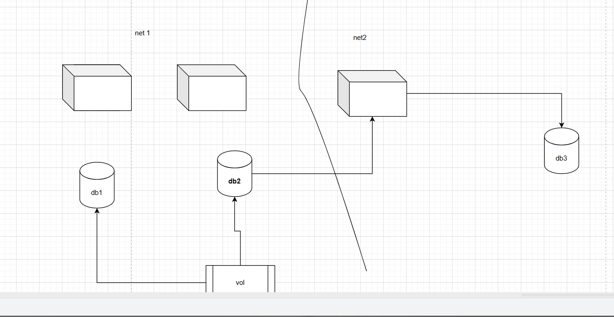
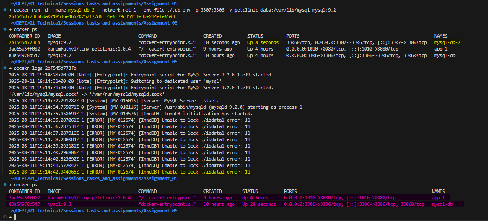
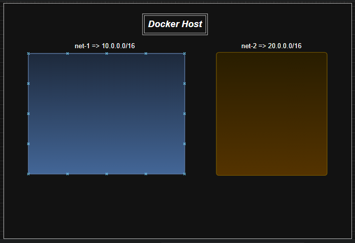
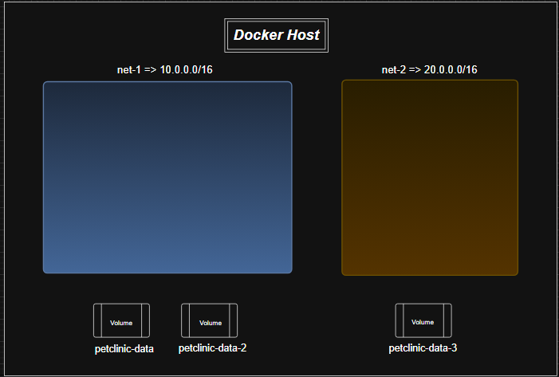
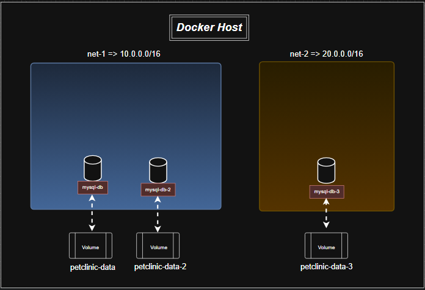
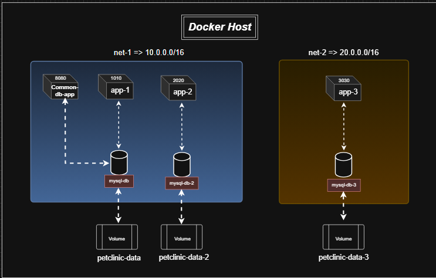
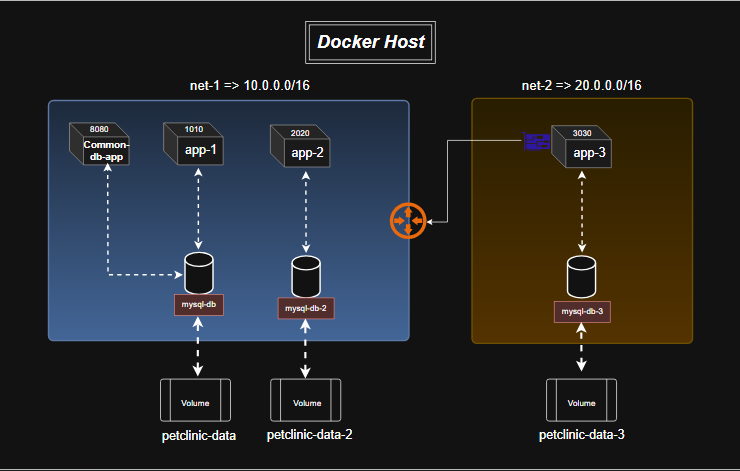

# Assignment_05

## **Table of Contents**

1. [I Tried to Make a Solution for It, but the Problems Were...](#i-tried-to-make-a-solution-for-it-but-the-problems-were)
2. [Implementation Steps: Building the Solution Environment](#implementation-steps-building-the-solution-environment)
   * [Environment Files](#environment-files)
   * [Docker Security Best Practices](#docker-security-best-practices)
   * [Creating Networks](#creating-networks)
   * [Creating Volumes](#creating-volumes)
   * [Running the Databases](#running-the-databases)
   * [Running the Application Containers](#running-the-application-containers)
3. [The Switching Script & Best Practices](#the-switching-script--best-practices)
   * [Troubleshooting `app-3` Connectivity](#troubleshooting-app-3-connectivity)
   * [The Final Switching Script](#the-final-switching-script)
4. [Final Corrected Schema](#final-corrected-schema)
5. [Conclusion](#conclusion)

-----

## I Tried to Make a Solution for It, but the Problems Were...

The initial task was to implement a Dockerized application stack. My first approach led to a critical error when two database containers were configured to use a single volume. This was the problem I faced:

**The Original Schema:**
> 

> 

**The Error:**
The following commands were used, which attempted to bind two separate database containers to the **same volume** named `petclinic-data`.

```dockerfile
docker run -d --name mysql-db --restart always --network net-1 -p 3306:3306 -v petclinic-data:/var/lib/mysql --env-file ./env/.db-env mysql:9.2
docker run -d --name mysql-db-2 --restart always --network net-1 -p 3306:3306 -v petclinic-data:/var/lib/mysql --env-file ./env/.db-env mysql:9.2
```

### This resulted in a container restart loop with the following error logs:

> 

**Root Cause:** The `InnoDB: Unable to lock` error confirms that a Docker volume is a **stateful resource designed for a single container**. When the second database container tried to write to the same files as the first, it was blocked, causing the container to crash.

-----

## Implementation Steps: Building the Solution Environment

The corrected schema was implemented with a series of commands, each building on the last.

### Environment Files

To manage sensitive credentials and connection strings, the following environment files were created. These files were passed to containers using the `--env-file` flag.

**Environment Files Used:**

  - `.db-env` (for database containers):

    ```properties
    MYSQL_ROOT_PASSWORD=password-root
    MYSQL_DATABASE=petclinic-db
    MYSQL_USER=db-user
    MYSQL_PASSWORD=db-user-password
    ```

  - `.connect-to-db-1.env` (for app-1):

    ```properties
    SPRING_DATASOURCE_URL=jdbc:mysql://mysql-db:3306/petclinic-db
    SPRING_DATASOURCE_USERNAME=db-user
    SPRING_DATASOURCE_PASSWORD=db-user-password
    SPRING_PROFILES_ACTIVE=mysql
    ```

  - `.connect-to-db-2.env` (for app-2):

    ```properties
    SPRING_DATASOURCE_URL=jdbc:mysql://mysql-db-2:3306/petclinic-db
    SPRING_DATASOURCE_USERNAME=db-user
    SPRING_DATASOURCE_PASSWORD=db-user-password
    SPRING_PROFILES_ACTIVE=mysql
    ```

  - `.connect-to-db-3.env` (for app-3):

    ```properties
    SPRING_DATASOURCE_URL=jdbc:mysql://mysql-db-3:3306/petclinic-db
    SPRING_DATASOURCE_USERNAME=db-user
    SPRING_DATASOURCE_PASSWORD=db-user-password
    SPRING_PROFILES_ACTIVE=mysql
    ```

*(Each file is tailored for its respective app/database pairing, ensuring correct connectivity and isolation.)*

  ### Docker Security Best Practices

  It is a security risk to embed credentials in the **Dockerfile** with `ENV`. This bakes sensitive information into the image's layers, making it accessible to anyone with the image. The best practice is to use **environment files (`--env-file`)** at runtime. This keeps the Docker image secure and generic, while passing sensitive information only to the running container.

  #### Using [.dockerignore](./.dockerignore) for Security
  To prevent sensitive environment files from being accidentally included in the Docker image, a `.dockerignore` file was created with the following content:

```
# Exclude all .env files
*.env
Docekrfile
Solution.md
switch-app3-db.sh
```
### Creating Networks

First, two distinct networks were created to isolate services.

```properties
docker network create --subnet 10.0.0.0/16 net-1
docker network create --subnet 20.0.0.0/16 net-2
```

> 


### Creating Volumes

Next, a separate volume was created for each database to ensure persistent and isolated data storage.

```properties
docker volume create petclinic-data
docker volume create petclinic-data-2
docker volume create petclinic-data-3
```

> 

### Running the Databases

The three database containers were started, each on its correct network, with its own dedicated volume, and configured using the `--env-file` flag.

```properties
# Run mysql-db on net-1 with petclinic-data volume
docker run -d --name mysql-db --network net-1 -v petclinic-data:/var/lib/mysql --env-file ./env/.db-env mysql:9.2

# Run mysql-db-2 on net-1 with petclinic-data-2 volume
docker run -d --name mysql-db-2 --network net-1 -v petclinic-data-2:/var/lib/mysql --env-file ./env/.db-env mysql:9.2

# Run mysql-db-3 on net-2 with petclinic-data-3 volume
docker run -d --name mysql-db-3 --network net-2 -v petclinic-data-3:/var/lib/mysql --env-file ./env/.db-env mysql:9.2
```

>  

### Running the Application Containers

The application containers were run on their respective networks, using their specific environment files for database connection.

```properties
# Run common-db-app on net-1 with mysql-db
docker run -d --name common-db-app --network net-1 -p 8080:8080 --env-file ./.connect-to-db-1.env karimfathy1/tiny-petclinic:1.0.4

# Run app-1 on net-1
docker run -d --name app-1 --network net-1 -p 1010:8080 --env-file ./.connect-to-db-1.env karimfathy1/tiny-petclinic:1.0.4

# Run app-2 on net-1
docker run -d --name app-2 --network net-1 -p 2020:8080 --env-file ./.connect-to-db-2.env karimfathy1/tiny-petclinic:1.0.4

# Run app-3 on net-2
docker run -d --name app-3 --network net-2 -p 3030:8080 --env-file ./.connect-to-db-3.env karimfathy1/tiny-petclinic:1.0.4
```
> 
-----

## The Switching Script & Best Practices

### Troubleshooting `app-3` Connectivity

During troubleshooting, a key step was manually connecting `app-3` to `net-1` to prove that network isolation was the root cause of the initial connection issues.

```properties
docker network connect net-1 app-3
```

> 

## The Final [Switching Script](switch-app3-db.sh)
### To solve the challenge of dynamically connecting `app-3` to either `mysql-db-2` or `mysql-db-3`, the following script was created. It provides an automated and robust solution by handling stopping the old container, switching the network, and passing the correct environment file.

```bash
#!/bin/bash

if [ -z "$1" ]
then
    echo "Error: Please specify the target database: [mysql-db-2 | mysql-db-3]"
    exit 1
fi

TARGET_DB=$1
APP_IMAGE="karimfathy1/tiny-petclinic:1.0.4"

echo "Stopping and removing existing app-3 container, Please wait..."
docker stop app-3 &>/dev/null
docker rm app-3 &>/dev/null

if [ "$TARGET_DB" == "mysql-db-2" ]
then
    NETWORK="net-1"
    DATABASE_HOST="mysql-db-2"
    ENV_FILE="./.connect-to-db-2.env"

elif [ "$TARGET_DB" == "mysql-db-3" ]
then
    NETWORK="net-2"
    DATABASE_HOST="mysql-db-3"
    ENV_FILE="./.connect-to-db-3.env"
else
    echo "Invalid database name. Please use 'mysql-db-2' or 'mysql-db-3'"
    exit 1
fi

echo "Switching app-3 to connect to $DATABASE_HOST on network $NETWORK..."

docker run -d --restart always --name app-3 --network "$NETWORK" -p 3030:8080 --env-file "$ENV_FILE" "$APP_IMAGE"

echo "Done. app-3 is now connected to $DATABASE_HOST."
```

-----

## Final Corrected Schema

The assignment demonstrated the importance of correct Docker networking and data management.

**The Final Corrected Schema:**

> 

-----

## Conclusion

### By understanding the principle of volume isolation and using a flexible scripting approach for dynamic configuration, the application was successfully deployed to connect to multiple databases across isolated networks.