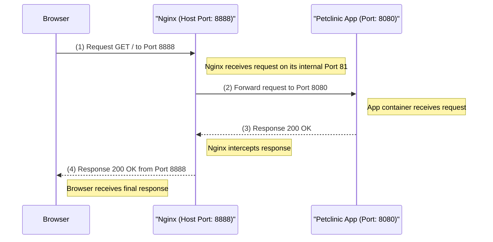

Of course. Here is the updated solution file with the Mermaid sequence diagram added to a new section explaining the architecture.

-----

# Final Solution: Deploying PetClinic with Nginx & MySQL Replication

## Outlines:

1.  **Objective:** Explain how to deploy a multi-container PetClinic application with a reverse proxy (Nginx) and a database that supports replication (Primary/Replica) using Docker Compose.
2.  **Project Structure:** Display the required files and folders.
3.  **Architectural Overview:** A diagram showing how user requests are processed.
4.  **Configuration Files:** Provide the complete content for all files.
5.  **How to Run:** A step-by-step guide to launch the project and link the databases.
6.  **Verifying Success:** How to confirm that everything is working as expected.

-----

## 1\. Project Structure 📂

To begin, you must have the following file and folder structure:

```
/working-area
├── docker-compose.yml
├── nginx-conf/
│   └── app.conf
├── db-primary/
│   └── primary.cnf
├── db-replica/
│   └── replica.cnf
└── env/
    ├── .app.env
    └── .db.env
```

-----

## 2\. Architectural Overview  DIAGRAM

The following diagram illustrates how Nginx acts as a reverse proxy. It receives requests from the user's browser, forwards them to one of the available application containers, and then adds a custom header (`Replica-ID`) to the response so you can see which specific container handled the request.



-----

## 3\. Configuration Files

This is the complete content that should be inside each file.

### a. `docker-compose.yml` File

This is the main file that orchestrates all the containers to work together.

```yaml
version: '3.8'
services:
  nginx:
    image: nginx
    volumes:
      - ./nginx-conf/:/etc/nginx/conf.d
    networks:
      - net-1
    ports:
      - "8888:81"
    depends_on:
      - app

  app:
    image: karimfathy1/tiny-petclinic:1.0.4 
    networks:
      - net-1
    env_file:
      - ./env/.app.env
    depends_on:
      primary-db: 
        condition: service_started
    restart: on-failure

  primary-db:
    image: mysql:8.0.33 # Using a specific version for stability
    container_name: primary-db-cont
    networks:
      - net-1
    volumes:
      - primary_db_vol:/var/lib/mysql
      - ./db-primary/primary.cnf:/etc/mysql/conf.d/primary.cnf 
    env_file:
      - ./env/.db.env
    healthcheck:
      test: ["CMD-SHELL", "mysql -h localhost -u root -e 'USE petclinic-db; SHOW TABLES LIKE ''owners'';' | grep owners"]
      interval: 10s
      timeout: 5s
      retries: 30
    restart: always

  replica-db-1:
    image: mysql:8.0.33 # Using the same version
    container_name: replica-db-cont-1
    networks:
      - net-1
    volumes:
      - replica-db-vol-1:/var/lib/mysql
      - ./db-replica/replica.cnf:/etc/mysql/conf.d/replica.cnf
    env_file:
      - ./env/.db.env
    command: --server-id=2
    depends_on: 
      primary-db:
        condition: service_healthy
    restart: always
    
volumes:
  primary_db_vol: {}
  replica-db-vol-1: {}

networks:
  net-1: {}
```

### b. `nginx-conf/app.conf` File

Nginx settings to act as a reverse proxy and distribute requests.

```nginx
upstream backends {
    server app:8080;
}

server {
    listen 81;
    
    location / {    
        proxy_pass http://backends;
        proxy_set_header Host $host;
        add_header Replica-ID $upstream_addr;

        sub_filter '</body>' '<p style="text-align:center;color:gray;">Served by replica: $upstream_addr</p></body>';
        sub_filter_once on;
        proxy_set_header Accept-Encoding "";
    }
}
```

### c. `db-primary/primary.cnf` File

Settings to enable replication on the primary database.

```ini
[mysqld]
server-id=1
log-bin=mysql-bin
binlog-do-db=petclinic-db
```

### d. `db-replica/replica.cnf` File

Settings to prepare the replica database.

```ini
[mysqld]
relay-log=mysql-relay-bin
read-only=1
```

### e. `env/.db.env` File

Environment variables for the database.

```env
MYSQL_ROOT_PASSWORD=root
MYSQL_DATABASE=petclinic-db
MYSQL_USER=db-user
MYSQL_PASSWORD=db-user-password
```

### f. `env/.app.env` File

Environment variables for the application and how it connects to the database.

```env
SPRING_DATASOURCE_URL=jdbc:mysql://primary-db:3306/petclinic-db
SPRING_DATASOURCE_USERNAME=db-user
SPRING_DATASOURCE_PASSWORD=db-user-password
SPRING_PROFILES_ACTIVE=mysql
```

-----

## 4\. How to Run!

Follow these steps in order to launch the project and link the databases.

### Step 1: Start the Containers

From your project's root directory, run the following command to start everything at once. You can use the `--scale` flag to run multiple instances of the application.

```bash
docker compose up -d --scale app=3
```

Thanks to the intelligent `healthcheck`, Docker Compose will automatically delay the replica's startup until the tables have been created.

### Step 2: Link the Databases Manually

After all containers are running, configure the replication link.

**a. On `primary-db`:**

1.  Enter the container: `docker exec -it primary-db-cont bash`
2.  Log into MySQL: `mysql -u root -p`
3.  Create the replication user:
    ```sql
    CREATE USER 'replicator'@'%' IDENTIFIED WITH 'mysql_native_password' BY 'replication_password';
    GRANT REPLICATION SLAVE ON *.* TO 'replicator'@'%';
    FLUSH PRIVILEGES;
    ```
4.  Get the log status and **copy the `File` and `Position` values**:
    ```sql
    SHOW MASTER STATUS;
    ```
5.  Exit the container.

**b. On `replica-db-1`:**

1.  Enter the container: `docker exec -it replica-db-cont-1 bash`
2.  Log into MySQL.
3.  Run the following command after replacing the values you copied:
    ```sql
    CHANGE REPLICATION SOURCE TO
        SOURCE_HOST='primary-db',
        SOURCE_USER='replicator',
        SOURCE_PASSWORD='replication_password',
        SOURCE_LOG_FILE='[File_Name_You_Copied]',
        SOURCE_LOG_POS=[Position_Number_You_Copied];
    ```
4.  Start the replication process:
    ```sql
    START REPLICA;
    ```
5.  Exit the container.

-----

## 5\. Verifying Success

To make sure everything is working as expected.

### a. Check the Replica Status

Enter the `replica-db-1` container again and run the following command in MySQL:

```sql
SHOW REPLICA STATUS\G
```

You should see `Replica_IO_Running: Yes` and `Replica_SQL_Running: Yes`.

### b. Practical Test

1.  Open your browser and go to `http://localhost:8888`.
2.  Add new data (like a new owner).
3.  Connect to the `replica-db-1` database using `docker exec` and run a `SELECT` query to search for the new data. If you find it, it's a definitive proof that the entire process was successful.

