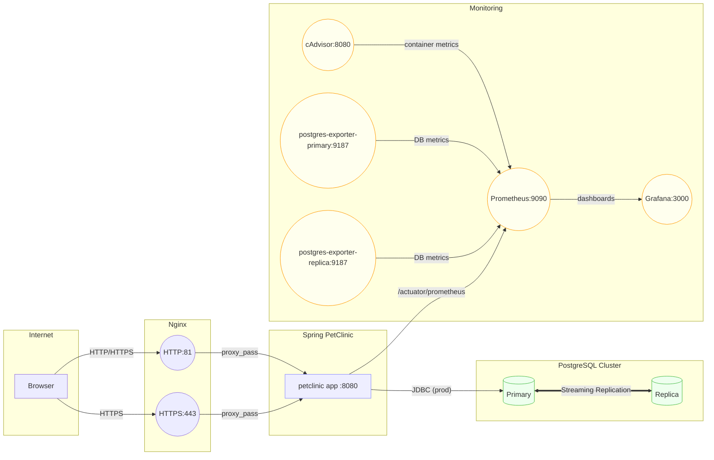

# Assignment\_07: Deploying Spring PetClinic with Nginx (HTTP/HTTPS), PostgreSQL Replication, and Monitoring (Prometheus + Grafana)

> **Goal**: A complete `Solution.md` — describing how to run **Spring PetClinic** behind **Nginx** with **PostgreSQL** (Primary/Replica) in **production**, with **MySQL** in **development**, plus monitoring using **Prometheus + cAdvisor + Grafana**, and tools **SonarQube** and **Nexus**.

---

## 1) Objectives

1. **Explain** how to deploy the multi-service **PetClinic** app with **Docker Compose**.
2. **Show** the required project structure.
3. **Diagram** that demonstrates the overall architecture.
4. **Configs**: Reference links to the configuration files instead of inlining their content.
5. **How to Run**: Clear commands for running **dev** and **prod**, building the image, and pushing to the local **Registry**.
6. **Verification**: Steps to validate app health, **replication**, and **metrics** collection.
7. **Troubleshooting** summary.

---

## 2) Project Description

This project focuses on deploying the **Spring PetClinic** application in two separate environments:

* **Development Environment**:

  * Runs with **MySQL** as the backend database.
  * Uses a simpler setup for faster iteration and testing.
  * Exposed via **Nginx** over HTTP/HTTPS.

* **Production Environment**:

  * Runs with a **PostgreSQL cluster** consisting of a **Primary** and a **Replica**.
  * Implements **streaming replication** for high availability.
  * Includes a full monitoring stack (**Prometheus**, **Grafana**, **cAdvisor**, **Postgres exporters**).
  * Secured and load-balanced via **Nginx**.

Both environments share the same **PetClinic app container image**, ensuring consistency between development and production.

---

## 3) Project Structure

```
/Assignment_07
├── Dockerfile
├── Solution.md
├── compose-files/
├── env-files/
├── nginx/
├── prometheus/
├── replication-files/
├── sonarscanner.md
└── spring-petclinic/
```

* [compose-files](./compose-files/)
* [env-files](./env-files/)
* [nginx configs](./nginx/nginx-conf/)
* [prometheus config](./prometheus/)
* [replication env](./replication-files/)
* [sonarscanner.md](./sonarscanner.md)
* [spring-petclinic](./spring-petclinic/)

---

## 4) Architectural Overview (Diagram)



---

## 5) How to Run

* **Development** (with MySQL):

  ```bash
  docker compose -f compose-files/docker-compose.dev.yaml up -d
  ```

* **Production** (with PostgreSQL Primary/Replica):

  ```bash
  docker compose -f compose-files/docker-compose.prod.yaml up -d
  ```

* **Monitoring Stack**:

  ```bash
  docker compose -f compose-files/docker-compose.monitor.yaml up -d
  ```

* **Tools (SonarQube, Nexus)**:

  ```bash
  docker compose -f compose-files/docker-compose.tools.yaml up -d
  ```

---

## 6) Build and Push Image

```bash
docker build -t localhost:8082/petclinic:1.0.0 .
docker push localhost:8082/petclinic:1.0.0
```

---

## 7) Verification

1. Access app: [http://localhost:81](http://localhost:81) or [https://localhost:443](https://localhost:443).
2. Check PostgreSQL replication:

   ```sql
   SELECT * FROM pg_stat_replication;
   ```
3. Prometheus targets: [http://localhost:9090/targets](http://localhost:9090/targets).
4. Grafana dashboards: [http://localhost:3000](http://localhost:3000).
5. Verify MySQL connection in **dev** with env vars from [connect-to-mysql.env](./env-files/connect-to-mysql.env).

---

## 8) Troubleshooting

* If **replica** does not sync → check configs in [replication-files](./replication-files/).
* If **Nginx** doesn’t proxy → confirm configs in [nginx-conf](./nginx/nginx-conf/).
* If **Prometheus** misses metrics → validate [prometheus.yml](./prometheus/prometheus.yml).
* Ensure volumes are cleared if old state persists: `docker volume prune`.
