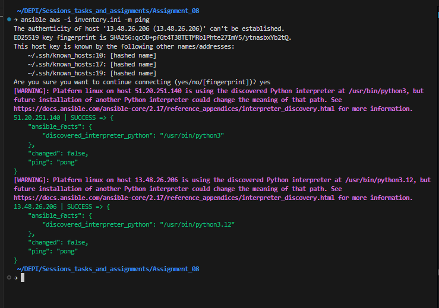
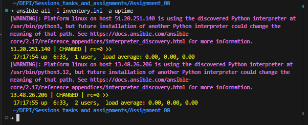

# Assignment_08: Ansible Basics - Ping All Managed Nodes

## Task
Ping all managed nodes listed in the `inventory.ini` file using Ansible.

## Ansible instalation for Ubuntu:
```bash
sudo apt update
sudo apt install software-properties-common
sudo apt-add-repository --yes --update ppa:ansible/ansible
sudo apt install ansible
ansible --version
python3 --version
```
## Check out: [Ansible Docs](https://docs.ansible.com/ansible/3/installation_guide/intro_installation.html#installing-ansible-on-ubuntu)
## Inventory File
The `inventory.ini` contains the following managed nodes:

```ini
[aws]
51.20.251.140 ansible_user=admin 
13.48.26.206 ansible_user=ec2-user ansible_ssh_private_key_file=./keys/Ansible-keypair.pem
```
## \# of course make your own public and private keys to use with the instances.
```bash
ssh-keygen -t rsa -f ./keys/Ansible-keypair.pem
```

## Solution Steps

1. **Command to Ping All Nodes:**
   Run the following Ansible command from the directory containing `inventory.ini`:
   
   ```bash
   ansible -i inventory.ini all -m ping
   ```

2. **Expected Output:**
   Each managed node should respond with a `pong` message, indicating successful connectivity. Example output:
   
   ```
   51.20.251.140 | SUCCESS => {
       "changed": false,
       "ping": "pong"
   }
   13.48.26.206 | SUCCESS => {
       "changed": false,
       "ping": "pong"
   }
   ```
> 

```bash
ansible -i inventory.ini aws -a uptime
```

> 

## Notes
- Ensure the private key file `Ansible-keypair.pem` exists at the specified path and has correct permissions (e.g., `chmod 600`).
- Make sure you have Ansible installed and configured on your control node.
- If you encounter SSH permission issues, verify the user and key settings in `inventory.ini`.
