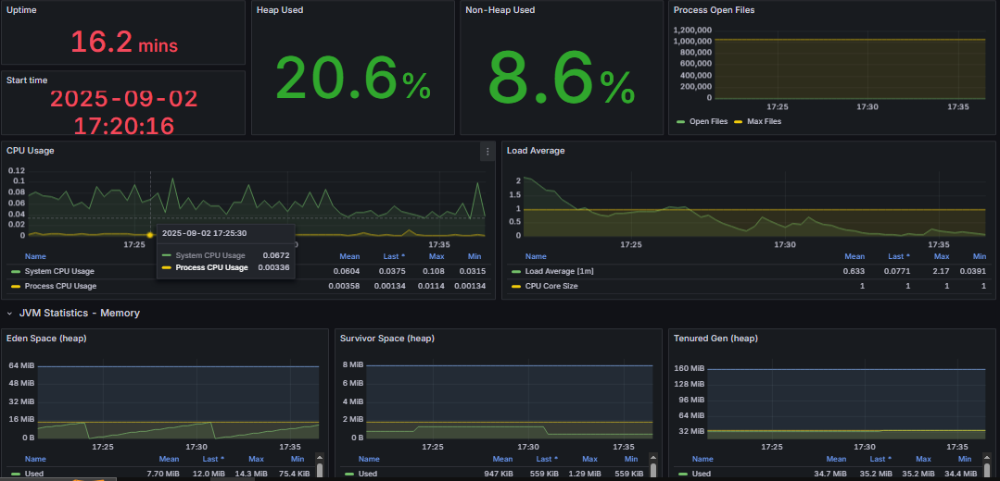

# Assignment_09: Ways to install Docker with Ansible & PetClinic Dyployment 

This document describes how I experimented with and implemented three different ways to install Docker on managed nodes using Ansible, and how I used those nodes to run the Spring PetClinic application. It includes small, copy-pasteable playbook examples, inventory snippets, and the commands I used to test the deployments.

## Directory structure

```
.
├── Solution.md
├── ways-to-install-docker
│   ├── install-docker-from-apt
│   ├── install-docker-from-role
│   └── install-docker-from-script
└── working-area
    ├── docker-petclinic
    └── full-petclinic
```

## Outline

- Purpose & goals
- Prerequisites
- Quick summary of the three approaches
- Detailed steps and embedded examples:
    - install from apt repository (package manager)
    - install from Docker convenience script
    - install using a role (`geerlingguy.docker`) + small `admin-setup` role
- How to run the PetClinic examples (`docker-petclinic` and `full-petclinic`)
- Verification and troubleshooting tips
- Files changed / where to look

## Purpose & goals

Goal: demonstrate multiple, idempotent ways to install Docker on remote hosts with Ansible, show how to run the PetClinic app on those hosts, and provide ready-to-use snippets so you can reproduce the results quickly.

## Prerequisites

- Control machine: Linux (Bash shell) with Ansible installed.
- SSH access to managed nodes (private key present and referenced in inventory or `ansible.cfg`).
- The repository layout used in this assignment (see project folders: `ways-to-install-docker` and `working-area`).

## Quick summary of the three approaches

1. install-docker-from-apt — simple apt-based installation (good for controlled environments; explicit package pins possible).
2. install-docker-from-script — use Docker's official convenience script (fast, gets latest Docker; less control than distro packages).
3. install-docker-from-role — use the community `geerlingguy.docker` role (recommended for production-like, idempotent deployments).


## check out: [Docker docs](https://docs.docker.com/engine/install/ubuntu/#install-using-the-repository)


## 1) Install from apt (example)

This approach installs Docker packages using the distribution package manager. The project folder `ways-to-install-docker/install-docker-from-apt` contains a `playbook.yaml` like the following minimal example:

```yaml
---
---
- name: Setup User and Install Docker
  hosts: all

  tasks:
    - name: 1. Add 'admin' user
      ansible.builtin.user:
        name: admin
        state: present
        create_home: yes
        shell: /bin/bash

    - name: 2. Make 'admin' user a passwordless sudoer
      ansible.builtin.lineinfile:
        path: /etc/sudoers.d/admin
        line: 'admin ALL=(ALL) NOPASSWD: ALL'
        owner: root
        group: root
        mode: '0440'
        create: true
        validate: 'visudo -cf %s'
    - name: 3. Add SSH public key for the 'admin' user for passwordless login
      authorized_key:
        user: admin
        state: present
        key: "{{ lookup('file', '/home/Heisenberg/.ssh/id_rsa.pub') }}"

    - name: 4. Install prerequisites for Docker repository
      ansible.builtin.apt:
        name:
          - ca-certificates
          - curl
        state: present
        update_cache: yes

    - name: 5. Create Docker's GPG key directory
      ansible.builtin.file:
        path: /etc/apt/keyrings
        mode: '0755'
        state: directory

    - name: 6. Add Docker's official GPG key
      ansible.builtin.get_url:
        url: https://download.docker.com/linux/ubuntu/gpg
        dest: /etc/apt/keyrings/docker.asc
        mode: '0644'

    - name: 7. Add the Docker APT repository (with fix for new OS versions)
      apt_repository:
        repo: "deb [arch=amd64 signed-by=/etc/apt/keyrings/docker.asc] https://download.docker.com/linux/ubuntu jammy stable"
        state: present
        filename: docker

    - name: 8. forcce update the packages
      ansible.builtin.apt:
        update_cache: yes
    
    - name: 9. Install Docker Engine and related packages
      ansible.builtin.apt:
        name:
          - docker-ce
          - docker-ce-cli
          - containerd.io
          - docker-buildx-plugin
          - docker-compose-plugin
        state: present
        update_cache: yes

    - name: 10. Add 'admin' user to the 'docker' group
      ansible.builtin.user:
        name: admin
        groups: docker
        append: yes

    - name: 11. Start and enable the Docker service
      ansible.builtin.service:
        name: docker
        state: started
        enabled: yes

```

Project files (local to this example):

- Playbook: [playpbook.yaml](ways-to-install-docker/install-docker-from-apt/playbook.yaml)
- Inventory: [inventory.ini](ways-to-install-docker/install-docker-from-apt/inventory.ini)
- Local config: [ansible.cfg](ways-to-install-docker/install-docker-from-apt/ansible.cfg)


Run it from the `install-docker-from-apt` directory:

```properties
ansible-playbook  playbook.yaml 
```


## 2) Install from Docker convenience script (example)

This method downloads and executes Docker's official install script. The `install-docker-from-script/playbook.yaml` contains a task similar to:

```yaml
- name: Install Docker using the convenience script
    hosts: all
    become: true
    tasks:
        - name: Download get.docker.com
            get_url:
                url: https://get.docker.com/
                dest: /tmp/get-docker.sh
                mode: '0755'
        
                    ...

        - name: Run Docker install script
            command: /tmp/get-docker.sh
            notify: restart_docker  
        
    handlers:
      - name: restart_docker
        service:
          name: docker
          state: restarted
```


Project files (local to this example):

- Playbook: [playpbook.yaml](ways-to-install-docker/install-docker-from-script/playbook.yaml)
- Inventory: [inventory.ini](ways-to-install-docker/install-docker-from-script/inventory.ini)
- Local config: [ansible.cfg](ways-to-install-docker/install-docker-from-script/ansible.cfg)

Run Run it from the `install-docker-from-script` directory:

```properties
ansible-playbook  playbook.yaml
```

Notes:
- This gives you the convenience of the latest Docker packages maintained by Docker.
- It's fast, but less controlled than installing via distro packages.


## 3) Install using Ansible role (`geerlingguy.docker`)

This is the approach used in `install-docker-from-role` and is my recommended option for real projects. It uses a small `admin-setup` role (for user and sudo setup) and the community `geerlingguy.docker` role to manage Docker installation and configuration across distributions.

fisrt you have to install the geerlingguy.docker role on your control node:

```bash
ansible-galaxy install geerlingguy.docker
```
include this role to the `playbook.yaml` file

Example `playbook.yaml` that includes both roles:

```yaml
---
- name: isntall docker from ansible role
  hosts: aws
  roles:
    - admin-setup
    - geerlingguy.docker
```

Key benefits:
- `geerlingguy.docker` is idempotent and supports multiple distros.
- Roles split responsibilities: `admin-setup` for user creation and `geerlingguy.docker` for Docker config.

Project files (local to this example):

- Playbook: [playbook.yaml](ways-to-install-docker/install-docker-from-role/playbook.yaml)
- Inventory: [inventory.ini](ways-to-install-docker/install-docker-from-role/inventory.ini)
- Local config: [ansible.cfg](ways-to-install-docker/install-docker-from-role/ansible.cfg)

Run it from the `install-docker-from-role` directory:

```properties
ansible-playbook playbook.yaml
```

# Running the PetClinic 

Two example projects are in `working-area`:

- `docker-petclinic`: simple app delivered as a single container.
- `full-petclinic`: multi-service deployment (app, DB, reverse proxy, monitoring) via Docker Compose and roles.

### 1. docker-petclinic (simple)

This project demonstrates building a Docker image and running the container via an Ansible role. The role `docker-works` in `working-area/docker-petclinic/roles/docker-works` contains tasks to build and run the image from the `Dockerfile`.

To deploy from the control node:

project files (local to this example):
- Playbook: [playbook.yaml](working-area/docker-petclinic/playbook.yaml)
- Inventory: [inventory.ini](working-area/docker-petclinic/inventory.ini)
- Local config: [ansible.cfg](working-area/docker-petclinic/ansible.cfg)

```bash
cd working-area/docker-petclinic
ansible-playbook playbook.yaml
```

### 2. full-petclinic (multi-service) - check [Assignment_07](../Assignment_07/) files


`full-petclinic` uses a role `deploy-petclinic-app` that places compose files and runs Docker Compose to bring up multiple services (app, postgres, nginx, monitoring stack).

From the control node:

project files (local to this example):
- Playbook: [playbook.yaml](working-area/full-petclinic/playbook.yaml)
- Inventory: [inventory.ini](working-area/full-petclinic/inventory.ini)
- Local config: [ansible.cfg](working-area/full-petclinic/ansible.cfg)

```bash
cd working-area/full-petclinic
ansible-playbook playbook.yaml 
```

Grafana results:


## Verification & troubleshooting

- Check service status on the managed node:

```bash
ssh -i docker-petclinic.pem ubuntu@<host-ip> "sudo systemctl status docker"
```

- Use `ansible -m ping all -i inventory.ini` to confirm connectivity.
- Check Docker version:

```bash
ssh -i docker-petclinic.pem ubuntu@<host-ip> "docker --version && docker compose version"
```
