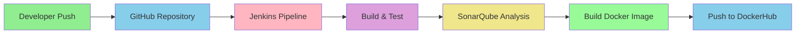
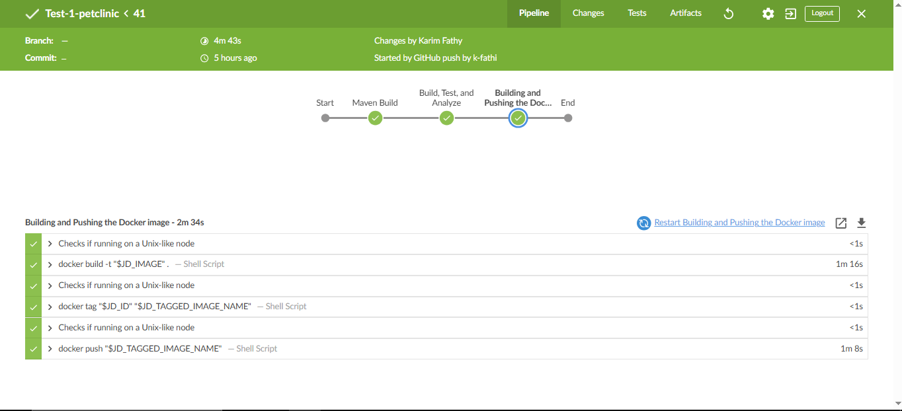
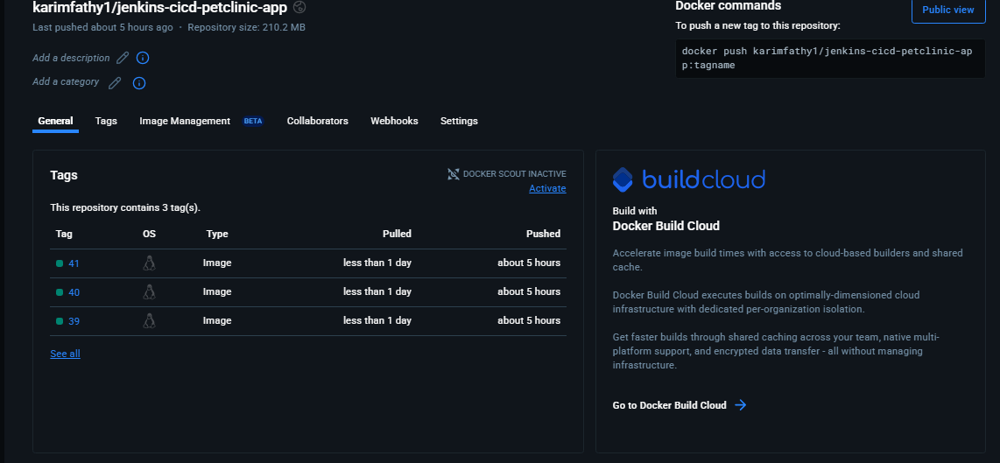

# CI/CD Pipeline Implementation with Jenkins, SonarQube, and Docker

## Overview
This solution implements a complete CI/CD pipeline for the Spring PetClinic application using Jenkins, SonarQube, and Docker. The pipeline includes code quality analysis, automated testing, and containerization.

## Architecture Overview


## Pipeline Stages

1. **Checkout**: 
   - Pulls the latest code from GitHub repository

2. **Build & Test**: 
   - Compiles the application
   - Runs unit tests
   - Generates test reports

3. **SonarQube Analysis**:
   - Performs code quality analysis
   - Checks for code smells, bugs, and vulnerabilities
   - Enforces coding standards

4. **Build Docker Image**:
   - Creates Docker image for the application
   - Tags the image with build number and latest

5. **Push to DockerHub**:
   - Authenticates with DockerHub
   - Pushes the tagged images

## Infrastructure Setup

### 1. Jenkins Setup (docker-compose.yaml)
```yaml
version: '3'
services:
  jenkins:
    build: .
    container_name: jenkins
    ports:
      - '8080:8080'
    dns:
      - 8.8.8.8
      - 1.0.0.1
    volumes:
      - 16_jenkins_try_jenkins-data:/var/jenkins_home/
      - /var/run/docker.sock:/var/run/docker.sock
      - /usr/bin/docker:/usr/bin/docker
    networks:
      - 16_jenkins_try_jenkins-net
    restart: always

volumes:
  16_jenkins_try_jenkins-data:
    external: true

networks:
  16_jenkins_try_jenkins-net:
    external: true
```

### 2. SonarQube Setup (docker-compose.sonar.yaml)
```yaml
version: '3.8'
services:
  sonarqube:
    image: sonarqube:latest
    container_name: sonarqube
    ports:
      - "9000:9000"
    environment:
      - SONAR_JDBC_URL=jdbc:postgresql://sonarqube-db:5432/sonar
      - SONAR_JDBC_USERNAME=sonar
      - SONAR_JDBC_PASSWORD=sonar
    volumes:
      - sonarqube_data:/opt/sonarqube/data
      - sonarqube_extensions:/opt/sonarqube/extensions
      - sonarqube_logs:/opt/sonarqube/logs

  sonarqube-db:
    image: postgres:13
    container_name: sonarqube-db
    environment:
      - POSTGRES_USER=sonar
      - POSTGRES_PASSWORD=sonar
      - POSTGRES_DB=sonar
    volumes:
      - postgresql_data:/var/lib/postgresql/data

volumes:
  sonarqube_data:
  sonarqube_extensions:
  sonarqube_logs:
  postgresql_data:
```

### 3. Spring PetClinic Docker Setup (docker-compose.yml)
```yaml
services:
  mysql:
    image: mysql:8.0
    container_name: mysql
    restart: unless-stopped
    environment:
      MYSQL_DATABASE: ${MYSQL_DATABASE}
      MYSQL_USER: ${MYSQL_USER}
      MYSQL_PASSWORD: ${MYSQL_PASSWORD}
      MYSQL_ROOT_PASSWORD: ${MYSQL_ROOT_PASSWORD}
    ports:
      - "3307:3306"
    volumes:
      - mysql_data:/var/lib/mysql
    healthcheck:
      test: ["CMD-SHELL", "mysqladmin ping -h localhost -uroot -p${MYSQL_ROOT_PASSWORD} || exit 1"]
      interval: 15s
      timeout: 10s
      retries: 10
      start_period: 40s
    networks:
      - petclinic-net

  petclinic:
    build:
      context: .
      dockerfile: Dockerfile
    container_name: spring-petclinic
    restart: unless-stopped
    depends_on:
      mysql:
        condition: service_healthy
    environment:
      SPRING_PROFILES_ACTIVE: mysql
    ports:
      - "9090:8080"
    networks:
      - petclinic-net
      - 16_jenkins_try_jenkins-net

volumes:
  mysql_data:

networks:
  petclinic-net:
    driver: bridge
  16_jenkins_try_jenkins-net:
    external: true
```

## Ngrok Integration

### Setting up Ngrok for Jenkins Webhook
1. Install ngrok:
```bash
curl -s https://ngrok-agent.s3.amazonaws.com/ngrok.asc | sudo tee /etc/apt/trusted.gpg.d/ngrok.asc >/dev/null && echo "deb https://ngrok-agent.s3.amazonaws.com buster main" | sudo tee /etc/apt/sources.list.d/ngrok.list && sudo apt update && sudo apt install ngrok
```

2. Configure ngrok:
```bash
ngrok config add-authtoken <your-auth-token>
```

3. Create a tunnel for Jenkins:
```bash
ngrok http 8080
```

4. Configure GitHub webhook:
   - Go to repository settings
   - Add webhook
   - Use the ngrok URL: `https://<your-ngrok-url>/github-webhook/`

## Project Configuration

### pom.xml Key Components
```xml
<project>
    <modelVersion>4.0.0</modelVersion>
    <groupId>org.springframework.samples</groupId>
    <artifactId>spring-petclinic</artifactId>
    <version>3.5.0-SNAPSHOT</version>
    
    <properties>
        <java.version>17</java.version>
        <sonar.host.url>http://localhost:9000</sonar.host.url>
        <sonar.login>${env.SONAR_TOKEN}</sonar.login>
    </properties>
    
    <dependencies>
        <!-- Spring Boot Dependencies -->
        <dependency>
            <groupId>org.springframework.boot</groupId>
            <artifactId>spring-boot-starter-web</artifactId>
        </dependency>
        <!-- Add other dependencies -->
    </dependencies>
    
    <build>
        <plugins>
            <plugin>
                <groupId>org.springframework.boot</groupId>
                <artifactId>spring-boot-maven-plugin</artifactId>
            </plugin>
            <plugin>
                <groupId>org.sonarsource.scanner.maven</groupId>
                <artifactId>sonar-maven-plugin</artifactId>
                <version>3.9.1</version>
            </plugin>
        </plugins>
    </build>
</project>
```

### Jenkinsfile
```groovy
pipeline {
    agent any

    environment {
        MAVEN_OPTS = '-Dmaven.test.skip=true'
    }

    stages {
        stage('Maven Build') {
            steps {
                sh './mvnw clean package verify'
            }
        }
        stage("Build, Test, and Analyze"){
            steps {
                echo "Building, Testing (unit/service), and Analyzing the App..."
                withSonarQubeEnv('SonarQube-server'){
                    withCredentials([string(credentialsId: 'sonar-token-2', variable: 'SONAR_TOKEN')]) {
                        sh './mvnw sonar:sonar'
                    }
                }
            }
        }

        stage("Building and Pushing the Docker image"){
            steps {
                script {
                    docker.withRegistry('', 'docker-login'){
                        def customImage = docker.build("karimfathy1/jenkins-cicd-petclinic-app:${env.BUILD_ID}")
                        customImage.push()
                    }
                }
            }
        }
        post{
            success{
                echo "The pipeline has completed successfully."
            }  
            failure{
                echo "The pipeline has failed. Please check the logs for details."
            }
        }
    }
}
```

## Setup Instructions

1. **Start Infrastructure**:
```bash
# Start Jenkins
cd jenkins-install
docker-compose up -d

# Start SonarQube
cd ../sonarqube
docker-compose -f docker-compose.sonar.yaml up -d

# Start Ngrok
ngrok http 8080
```

2. **Configure Jenkins**:
   - Install suggested plugins
   - Set up credentials for DockerHub and SonarQube
   - Configure GitHub webhook using ngrok URL

3. **Configure SonarQube**:
   - Generate authentication token
   - Add token to Jenkins credentials

4. **Setup Pipeline**:
   - Create new pipeline job
   - Configure GitHub repository
   - Add Jenkinsfile from repository

## Pipeline Workflow
1. Developer pushes code to GitHub
2. GitHub webhook triggers Jenkins pipeline
3. Jenkins pulls the code and starts the pipeline
4. Code is built and tested
5. SonarQube analyzes code quality
6. Docker image is built
7. Image is pushed to DockerHub
8. Application is ready for deployment

This setup provides a robust CI/CD pipeline with:
- Automated builds and tests
- Code quality analysis
- Container image creation
- Automated publishing to DockerHub
- Webhook integration for automated triggers

- 

- 