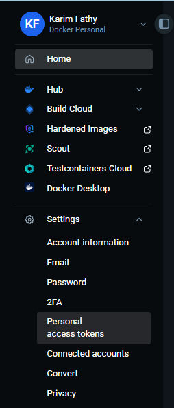
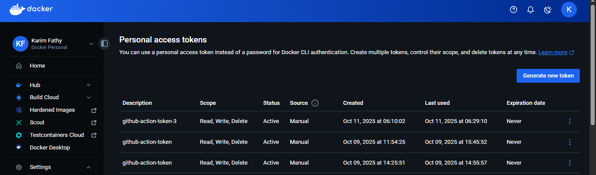
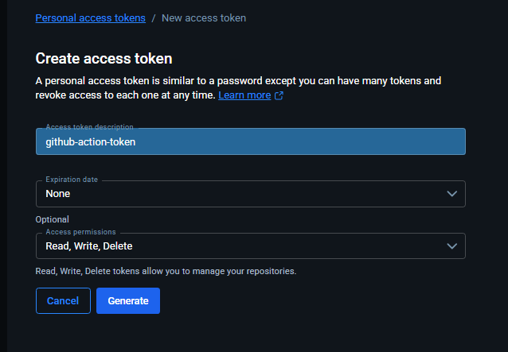
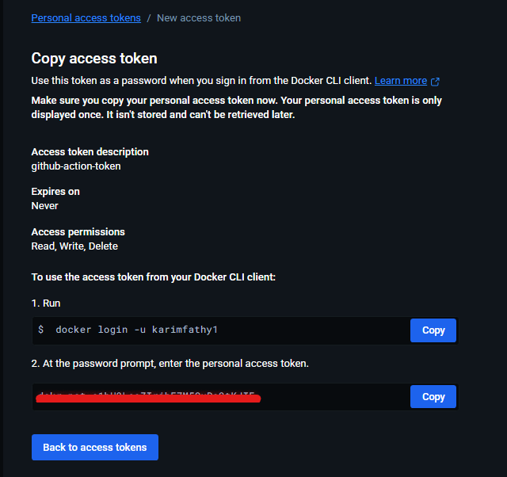
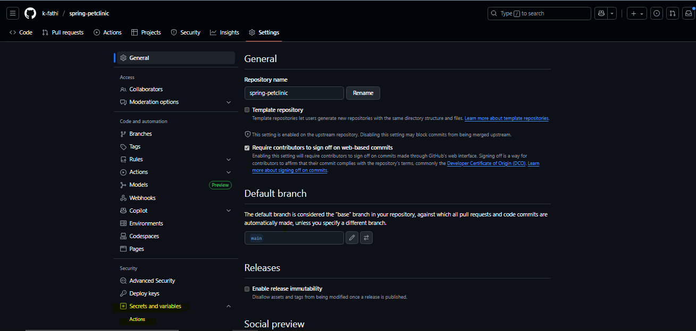
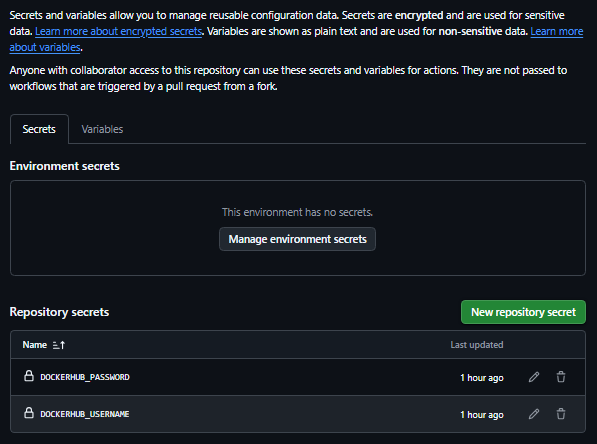
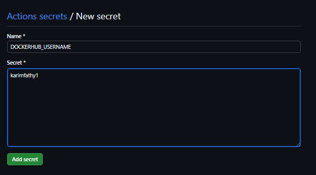
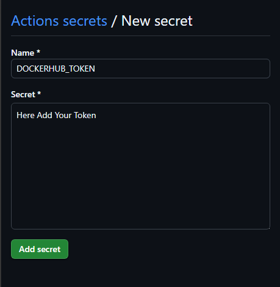

# Assignment\_13 - Deploy Spring-Petclinic with GitHub Actions

## Overview

This document provides a comprehensive breakdown of a Continuous Integration and Continuous Deployment (CI/CD) pipeline for the Spring-Petclinic application using GitHub Actions. The workflow automates the process of building, testing, and deploying the application to Docker Hub. It is triggered on every push to the `test` branch and on any pull request to the `main` branch, ensuring that code changes are continuously validated and deployed.

-----

## Full Workflow Code

Below is the complete YAML configuration for the GitHub Actions workflow for easy reference.

```yaml
name: Deploy Spring-Petclinic

on:
  push:
    branches:
      - test
  pull_request:
    branches: 
      - main

jobs:
  checkout:
    runs-on: ubuntu-latest
    steps:
      - name: Checkout repository
        uses: actions/checkout@v4
      - name: Upload source code
        uses: actions/upload-artifact@v4
        with:
          name: source-code
          path: .

  setup-java:
    runs-on: ubuntu-latest
    needs: checkout
    steps:
      - name: Download source code
        uses: actions/download-artifact@v4
        with:
          name: source-code
      - name: Set up JDK 17
        uses: actions/setup-java@v4
        with:
          java-version: '17'
          distribution: 'temurin'
          cache: maven
      - name: Upload java-ready code
        uses: actions/upload-artifact@v4
        with:
          name: java-ready
          path: .

  build:
    runs-on: ubuntu-latest
    needs: setup-java
    steps:
      - name: Download java-ready code
        uses: actions/download-artifact@v4
        with:
          name: java-ready
      - name: Build with Maven
        run: mvn clean package -DskipTests=true
      - name: Upload built jar
        uses: actions/upload-artifact@v4
        with:
          name: app-jar
          path: target/*.jar

  test:
    runs-on: ubuntu-latest
    needs: build
    steps:
      - name: Download source
        uses: actions/download-artifact@v4
        with:
          name: java-ready
      - name: Set up JDK 17
        uses: actions/setup-java@v4
        with:
          java-version: '17'
          distribution: 'temurin'
      - name: Run tests
        run: mvn test

  deploy:
    runs-on: ubuntu-latest
    needs: test
    steps:
      - name: Checkout repo
        uses: actions/checkout@v4

      - name: Log in to Docker Hub
        uses: docker/login-action@v3
        with:
          username: ${{ secrets.DOCKERHUB_USERNAME }}
          password: ${{ secrets.DOCKERHUB_PASSWORD }}

      - name: Build Docker image
        run: docker build -t ${{ secrets.DOCKERHUB_USERNAME }}/spring-petclinic:${{ github.sha }} .

      - name: Push to DockerHub
        run: docker push ${{ secrets.DOCKERHUB_USERNAME }}/spring-petclinic:${{ github.sha }}

      - name: Tag as latest (for main branch)
        if: github.ref == 'refs/heads/main'
        run: |
          docker tag ${{ secrets.DOCKERHUB_USERNAME }}/spring-petclinic:${{ github.sha }} ${{ secrets.DOCKERHUB_USERNAME }}/spring-petclinic:latest
          docker push ${{ secrets.DOCKERHUB_USERNAME }}/spring-petclinic:latest
```

-----

## How to Add the Workflow to Your Repository

1.  **Create the Directory Structure**: In the root of your repository, create a directory named `.github` and, inside it, another directory named `workflows`.
2.  **Create the Workflow File**: Inside the `.github/workflows` directory, create a new file and name it `deploy.yml`.
3.  **Add the Code**: Copy and paste the workflow YAML code from above into the `deploy.yml` file.
4.  **Commit and Push**: Commit the new file to your repository. GitHub Actions will automatically detect the file and trigger the workflow on the next push or pull request to the specified branches.

-----

## Workflow Visualization

The workflow consists of five sequential jobs. Each job must complete successfully before the next one begins.


-----

## Detailed Job Breakdown

Each job in the workflow runs on a fresh, isolated runner environment. Data is passed between them using artifacts.

### 1\. `checkout` Job

```yaml
checkout:
  runs-on: ubuntu-latest
  steps:
    - name: Checkout repository
      uses: actions/checkout@v4
    - name: Upload source code
      uses: actions/upload-artifact@v4
      with:
        name: source-code
        path: .
```

  * **Purpose**: To get a copy of the source code into the workflow environment.
  * **Steps**:
      * **Checkout repository**: Uses the `actions/checkout@v4` action to download the code from the current branch.
      * **Upload source code**: Uploads the entire repository as an artifact named `source-code`. This allows other jobs to access the same version of the code.

-----

### 2\. `setup-java` Job

```yaml
setup-java:
  runs-on: ubuntu-latest
  needs: checkout
  steps:
    - name: Download source code
      uses: actions/download-artifact@v4
      with:
        name: source-code
    - name: Set up JDK 17
      uses: actions/setup-java@v4
      with:
        java-version: '17'
        distribution: 'temurin'
        cache: maven
    - name: Upload java-ready code
      uses: actions/upload-artifact@v4
      with:
        name: java-ready
        path: .
```

  * **Purpose**: To prepare the environment with the correct Java version and cache Maven dependencies.
  * **Steps**:
      * **Download source code**: Downloads the `source-code` artifact created by the previous job.
      * **Set up JDK 17**: Uses the `actions/setup-java@v4` action to install Temurin JDK 17. The `cache: maven` option significantly speeds up future runs by saving downloaded dependencies.
      * **Upload java-ready code**: Uploads the source code again as a new artifact named `java-ready` to signal that the environment is now configured for Java/Maven operations.

-----

### 3\. `build` Job

```yaml
build:
  runs-on: ubuntu-latest
  needs: setup-java
  steps:
    - name: Download java-ready code
      uses: actions/download-artifact@v4
      with:
        name: java-ready
    - name: Build with Maven
      run: mvn clean package -DskipTests=true
    - name: Upload built jar
      uses: actions/upload-artifact@v4
      with:
        name: app-jar
        path: target/*.jar
```

  * **Purpose**: To compile the Java source code and package it into an executable `.jar` file.
  * **Steps**:
      * **Download java-ready code**: Downloads the `java-ready` artifact.
      * **Build with Maven**: Runs `mvn clean package -DskipTests=true`. This command compiles the code into a `.jar` file but skips running tests, as that is handled by a dedicated job.
      * **Upload built jar**: Uploads the final `.jar` file from the `target/` directory as an artifact named `app-jar`.

-----

### 4\. `test` Job

```yaml
test:
  runs-on: ubuntu-latest
  needs: build
  steps:
    - name: Download source
      uses: actions/download-artifact@v4
      with:
        name: java-ready
    - name: Set up JDK 17
      uses: actions/setup-java@v4
      with:
        java-version: '17'
        distribution: 'temurin'
    - name: Run tests
      run: mvn test
```

  * **Purpose**: To run all unit and integration tests to ensure the code is stable and correct.
  * **Steps**:
      * **Download source**: Downloads the `java-ready` artifact containing the source code.
      * **Set up JDK 17**: Installs the Java environment needed to run the tests.
      * **Run tests**: Executes `mvn test`. If any test fails, this job fails, which in turn stops the entire workflow and prevents the deployment of faulty code.

-----

### 5\. `deploy` Job

```yaml
deploy:
  runs-on: ubuntu-latest
  needs: test
  steps:
    - name: Checkout repo
      uses: actions/checkout@v4

    - name: Log in to Docker Hub
      uses: docker/login-action@v3
      with:
        username: ${{ secrets.DOCKERHUB_USERNAME }}
        password: ${{ secrets.DOCKERHUB_PASSWORD }}

    - name: Build Docker image
      run: docker build -t ${{ secrets.DOCKERHUB_USERNAME }}/spring-petclinic:${{ github.sha }} .

    - name: Push to DockerHub
      run: docker push ${{ secrets.DOCKERHUB_USERNAME }}/spring-petclinic:${{ github.sha }}

    - name: Tag as latest (for main branch)
      if: github.ref == 'refs/heads/main'
      run: |
        docker tag ${{ secrets.DOCKERHUB_USERNAME }}/spring-petclinic:${{ github.sha }} ${{ secrets.DOCKERHUB_USERNAME }}/spring-petclinic:latest
        docker push ${{ secrets.DOCKERHUB_USERNAME }}/spring-petclinic:latest
```
---

### `deploy` Job

* **Purpose**: To build a Docker image of the application and publish it to Docker Hub. This is the final step and only runs if all preceding jobs succeed.

* **Steps**:
    * **Checkout repo**:
        * Uses `actions/checkout@v4` to get the latest code from the repository. 
    * **Log in to Docker Hub**:
        * This crucial step uses the `docker/login-action@v3` to securely authenticate with Docker Hub.
        * It uses credentials stored as **GitHub Secrets**, ensuring your password is never exposed in the code.
        * You need to get your Docker Hub username and password (or access token) ready to create these secrets from Docker
    
    * **Build Docker image**:
        * Runs the `docker build` command. The image is tagged with the username and the commit SHA (`${{ github.sha }}`).
        * Using the commit SHA as a tag creates a unique, traceable image for every single code change.
    * **Push to DockerHub**:
        * Pushes the uniquely tagged image to your Docker Hub repository.
    * **Tag as latest (for main branch)**:
        * This is a conditional step that only executes if the workflow is running on the `main` branch.
        * It adds the `latest` tag to the image that was just pushed.
        * This is a common practice to mark the most recent, stable version of an application, making it easy for users to pull.


---

### Managing Secrets for Deployment

Secrets are essential for securely automating deployments.

* **What are GitHub Secrets?** Secrets are encrypted environment variables for storing sensitive information like passwords or API keys. Once created, they can be used in your workflows but their values cannot be viewed.

# **How to Create Secrets!!**:
## 1. In your Docker, navigate to **Settings**.

> 
    
## 2. Go to **Security** > **Generate New Token**.

> 

## 3. Create a new access token with the necessary permissions for pushing images.

> 
     
## 4. Copy the generated token.

> 

    
# **How to Add `DOCK-HUB_USERNAME` and `DOCKERHUB_PASSWORD`**:
## 1.  In your GitHub repository, navigate to **Settings**.
## 2.  In the left sidebar, go to **Secrets and variables** > **Actions**.

> 

## 3.  Click the **New repository secret** button.

> 

## 4.  Enter `DOCKERHUB_USERNAME` as the **Name** and your Docker Hub username as the **Value**. Click **Add secret**.

> 
        
## 5.  Repeat the process to create a secret named `DOCKERHUB_PASSWORD` with your Docker Hub password or an access token as the value.

> 


---

### Understanding Artifacts

* **What are Artifacts?** Artifacts are files (or collections of files) that are generated during a workflow run. They are used to share data between jobs that run on different machines.

* **How They Are Used in This Workflow**:
    * `source-code`: Preserves the initial state of the repository for use in later jobs.
    * `java-ready`: Represents the source code in a fully configured Java environment.
    * `app-jar`: Contains the final, executable application ready for deployment.

You can view and download all stored artifacts from the summary page of any workflow run in the Actions tab.
